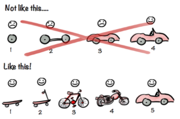
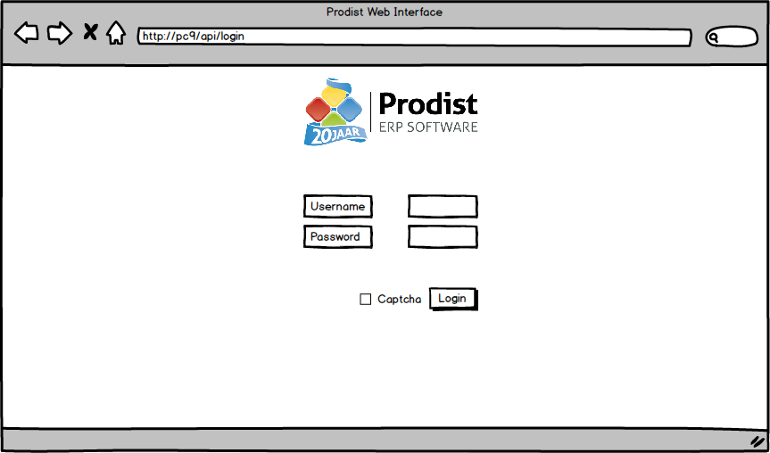

# Prodist Web Based ERP

## (1) Algemeen Informatie
 1.2 Project Titel: <b> Prodist Web-Based ERP</b>  
  1.3 Partners:  

| Naam                    | Email                       | Bedrijf | Telefoonnummer        | Rol             |
| ------------------------|:---------------------------:|---------|-----------------------|-----------------|
| Kor v/d Meulen          | k.vd.meulen@prodist.nl      | Prodist | +31 058 26 775 95     | Eigenaar        |
| Marco van Ijs           | m.v.ijs@prodist.nl          | Prodist | +31 058 26 77 595     | Project Overseer|
| Paul Roelvink           | p.roelvink@fcroc.nl         | CMG     | +31 6 23 94 85 57     | Coach           |
| Jamie Veenswijk         | j.veenswijk@prodist.nl      | Prodist | +31 6 18 68 76 43     | Stagaire        |

## (2) Project Omschrijving  

### 2.1  Inleiding  

 Het plan is om een nieuwe webbased ERP service aan te bieden die de huidige ondersteunt en daarna uiteindelijk overneemt. Dit gebeurd doormiddel van het Spotifymodel. 

 Door te ontwikkelen op deze manier stelt Prodist niet pas de software beschikbaar als het volledige oude pakket is overgezet maar ontwikkelen we eerst een basisversie (het skateboard)
    waarmee ongeveer 20% van de huidige klanten aan de slag kunnen.
    Hierdoor kan stapsgewijs de software worden ontwikkeld en functionaliteit steeds meer worden toegevoegd aan de service en de nieuwe applicatie. 

#### 2.1.1 Het bedrijf

 Prodist is een onhanfhankelijk ERP-ontwikkelaar gebaseerd in Leeuwarden. Het bedrijf is opgericht in 1996 en bestaat dus al 22 jaar.
    Met een team dat bestaat uit ca. 25 medewerkers helpt Prodist bedrijven bij het versimpelen van hun ingewikkelde bedrijfsprocessen.
    Prodist helpt deze bedrijven om efficiënter te stroomlijnen en biedt iedere klant een standaard ERP oplossing die flexibel in te richten is voor alle bedrijfsactiviteiten.
    Een gevolg van het implementeren van het ProdistERP systeem is dat gegevens van bijvoorbeeld klanten en producten binnen de organisatie slechts eenmaal ingevoerd hoeven te worden,
    omdat een enkele database wordt gehanteerd. Naast dat de kans op inconsistente data wordt verkleint, kan dit ERP systeem ook veel andere voordelen
    bieden zoals een efficiëntere manier van werken, betere communicatie en mogelijk kostenreductie. 

 Omdat Prodist al 22 jaar bestaat heeft het ontzettend veel ervaring in het aanbieden van ERP systemen. Door het succes eind jaren 90, breidde Prodist zich
    in meerdere landen uit zoals Finland, Sri Lanka, de Filipijnen, Indonesië en Duitsland. Dit was een grote en succesvolle uitbreiding, hierdoor kon Prodist zich uiteindelijk in meerdere branches
    ontwikkelen. In 2007 werd het platform volledig herzien. Waar de voorgaande software voornamelijk geschikt was voor bedrijven binnen de grafische industrie,
    kan Prodist nu ieder bedrijf automatiseren ongeacht branche of specialisme. 

#### 2.1.2 Doel  

 Het doel is om de huidige ERP software volledig webbased te lanceren. Bedrijven kunnen dan vanuit elk browser de Webbased ProdistERP draaien, ongeacht het besturingsysteem.
    Vanwege het zogenaamde SaaS-oplossing is de software onbeperkt schaalbaar en realtime up te daten terwijl de gebruiker gewoon kan doorwerken. Niet alleen is het zeer handig voor beide partijen maar ook veilig doormiddel van een token authenticatie die wordt opgehaald bij het inloggen. 

    

#### Begrippen

* [SaaS](https://nl.wikipedia.org/wiki/Software_as_a_Service)
* [Spotify Model](https://agilescrumgroup.nl/spotify-model/)
* [Enterprise Resource Planning (ERP)](https://nl.wikipedia.org/wiki/Enterprise_resource_planning)

    
##### 2.1.3 Doelstellingen

###### Afdelingsdoelen

* test omgeving creëren (Lokaal ASP.NET Core pagina)
* Login concept realiseren
* token authenticatie
* HTTPS
* Cloud?
###### Leerdoelen

* Zelfstudie
* Debuggen
* Documenteren
* Prioriteiten
* Communicatie

### 2.2 Functioneel Ontwerp Login pagina  

| Open het Web Interface | > Laat de gebruiker inloggen | > Kloppen de inlog gegevens? (ja) |  Het token wordt opgehaald | > Log de gebruiker in |
|------------------------|:----------------------------:|------------------------------|--------------------------|----------------------------------|  
|                        |                              | > (nee) Geef de gebruiker een melding |

### 2.3 Eisen & Wensen  

 * Simpel en gebruiksvriendelijk. (>> user friendly << Zeer belangrijk)
 * Backwards compatible met het oude pakket.
 * Snel koppelen met de huidige software.
 * Compatible met elk browser en Operating System.
 * Kan "On the fly" worden geupdate zonder dat de gebruiker iets ervan merkt.
 * Highly secure
 * SaaS-model
 * "Skateboard" voor eind juni 2019.

### 2.4 Concepten

##### Concept Login

### Bronnen

* [Prodist Info](http://prodisterp.nl/prodist-erp-software/over-prodist-erp/)
* [Prodist Web ERP](http://prodisterp.nl/geen-categorie/prodisterp-wordt-volledig-webbased/)
* [SaaS](https://nl.wikipedia.org/wiki/Software_as_a_Service)
* [Enterprise Resource Planning (ERP)](https://nl.wikipedia.org/wiki/Enterprise_resource_planning)
* 
